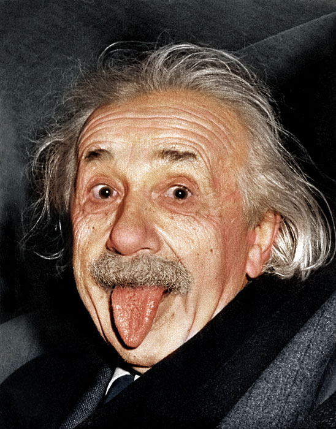
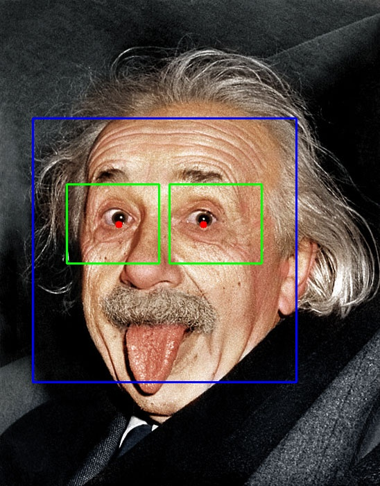

# Eye-Tracking

Python implementation of eye (pupil) tracking based on [Fabian's work](http://www.inb.uni-luebeck.de/fileadmin/files/PUBPDFS/TiBa11b.pdf). 

## Usage:
**To run with fixed image:**
python main 0 PATH_TO_IMAGE

**To run with camera frames:**
python main 1

## Results:

